

# **User Manual** 

## Final project computing graphics and human-machine interaction. 

### **Author** :
 - Vaquero Barajas Alexis 🐱‍👤
 - Cta: 316073934

  
#### **Semester 2022-2 | Group 04**

### **Requirements**

* To run Visual Studio 2019 with the C++ installation or with the .exe executable:
  - Windows 7 (latest update), Windows 8 (2919355), Windows 10 (version 1703 higher)
  - Processor: 1.8 GHz (recommended 4 cores or more)
  - 2.5 GB RAM minimum, 8 GB recommended
  - 2 GB on disk, recommended
  - Graphics chip with a minimum resolution of 720p

### **Project opening and execution**

Download the project from GitHub by clicking the blue "Code" button and selecting one of the options

    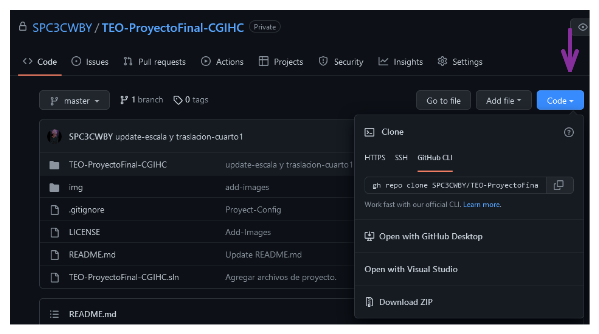</img>

 
If you select "Open with GitHub Desktop" you need to have this application installed on your computer and follow the steps to clone the repository locally, once
cloned jump ["Run .exe file"](#item1).

The "Download ZIP" selection will download a .zip file of the project, unzip it on your computer, return to this manual and skip to ["Run .exe file"](#item1).

 ### ***Run with Visual Studio*** 💻
 
If you wish and have the Visual Studio IDE installed, you can run the application by following the steps below.
Have the project downloaded from git-hub and have unzipped the zip folder. Once you have this open Visual Studio and select the option "Open a project or a solution"
 
 

  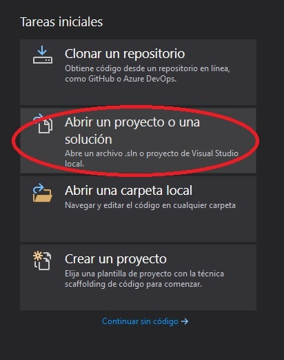</img>

 
 Find the file "TEO-ProyectoFinal-CGIHC.sln" inside the decompressed folder and click on the open button. 

  

  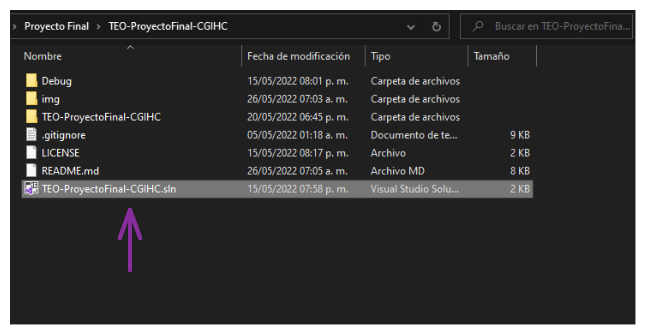</img>

 
Before executing the program we check that all the libraries and configurations are loaded correctly. We go to the solution explorer, right click on the project name and select the properties option.
 

  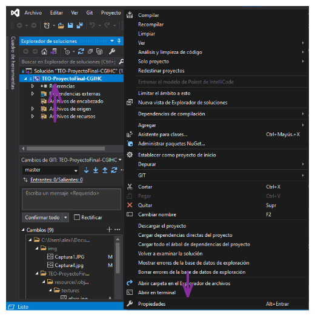</img>

 
 In the "General" section we verify that the Platform Toolkit is one that we have downloaded, it can be v142 or v143.
 
 

  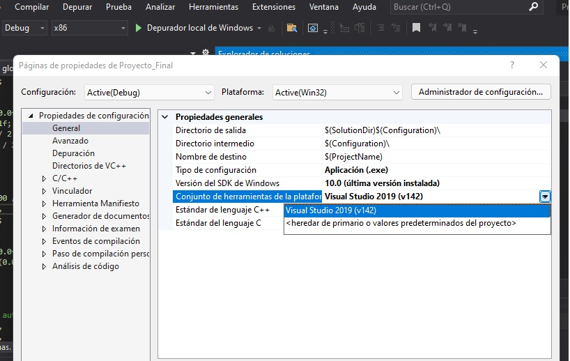</img>

 
Inside C/C++ -> General verify that the keyword **include** is found in additional include directories. In Linker -> General the word **lib** in Additional Library Directories and finally in Linker -> Input verify that the dependencies **Winmm.lib;SDL2.lib;SDL2main.lib;assimp-vc141-mtd.lib;opengl32.lib;glfw3.lib;kernel32.lib;user32.lib;gdi32.lib;winspool.lib;comdlg32.lib; advapi32.lib;shell32.lib;ole32.lib;oleaut32.lib;uuid.lib;odbc32.lib;odbccp32.lib;%(AdditionalDependencies)** are included in Additional Dependencies.
 
 

  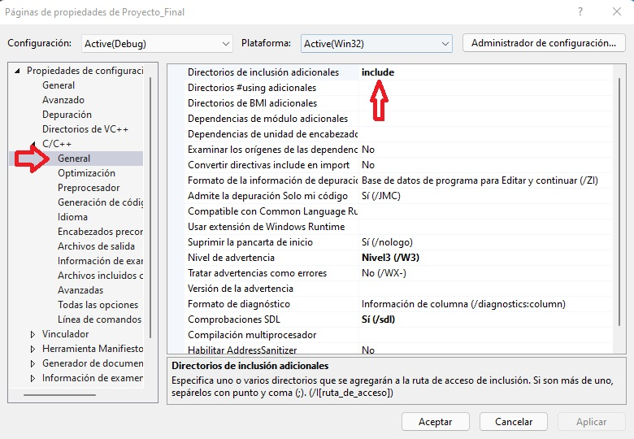</img>

 
 

  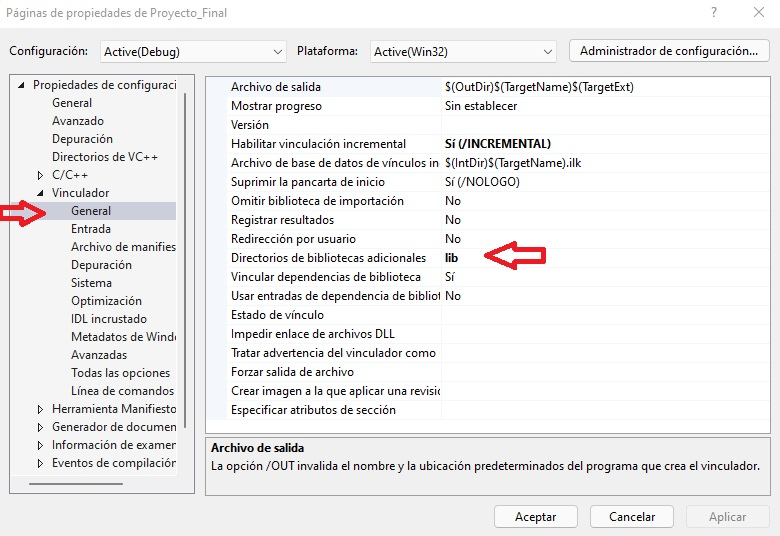</img>

 
 

  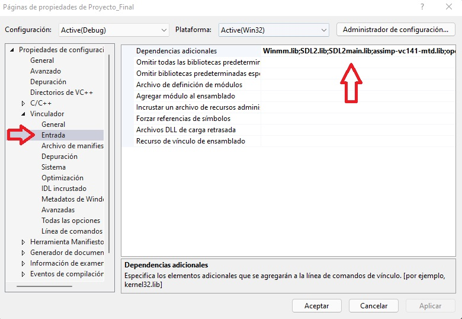</img>

 
 To run the project, you must select the "x86" option in the upper bar and verify that the "Debug" option is selected, as shown in the following image.
 
 

  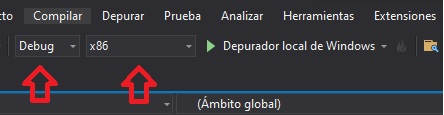</img>

 
 You can now run the project by clicking on the "Local Windows Debugger" button, this will open the program window.
 
  

  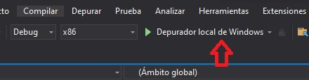</img>

 
 

 ### ***Run .exe file*** 🚀

Once the project has been cloned or the ZIP has been unzipped: open the generated folder or repository location on your computer and go to ".\TEO-ProyectoFinal-CGIHC\Ejecutable", locate the file "TEO-ProyectoFinal-CGIHC. exe" and double click to open. This will open a window with the virtual space running.

  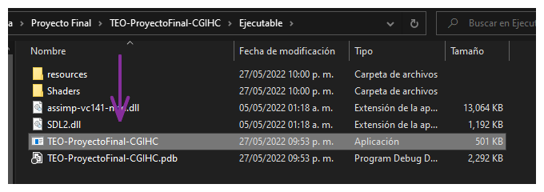</img>

 
## **Interaction with the environment** ⛺️

Once the window is open; Being inside the virtual space, the mouse is captured to work only inside it, so the cursor is not observed and the mouse movement only works inside the window. The interaction occurs through the keyboard and mouse of the computer.

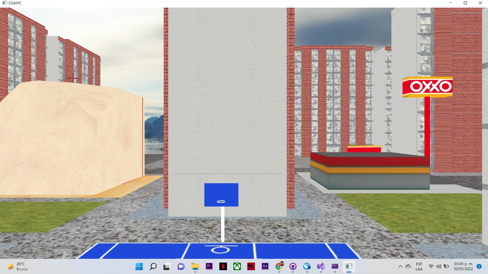</img>

 Church Model and location
 

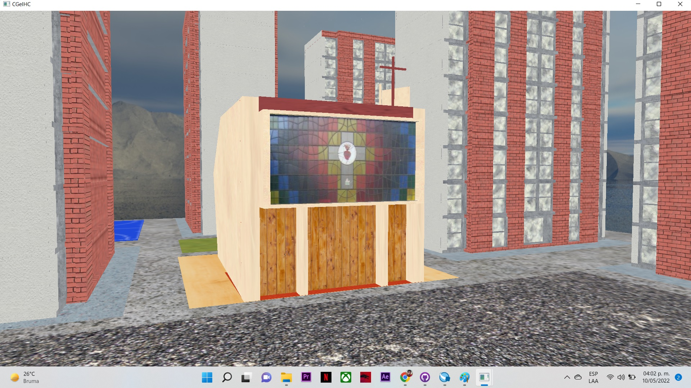</img>

 Oxxo Model and location
 

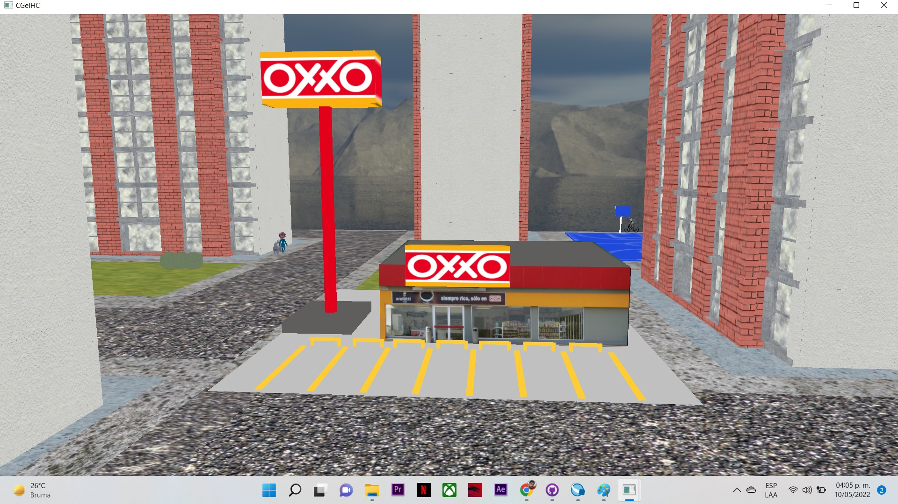

Facade where the rooms are located

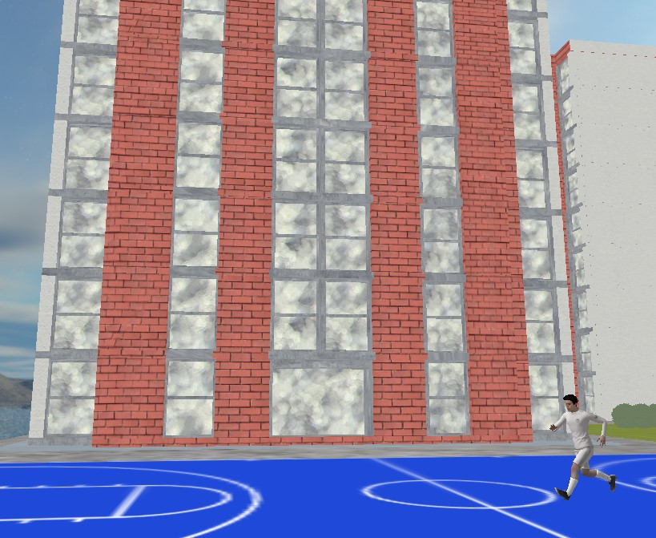</img>

Rooms inside the facade

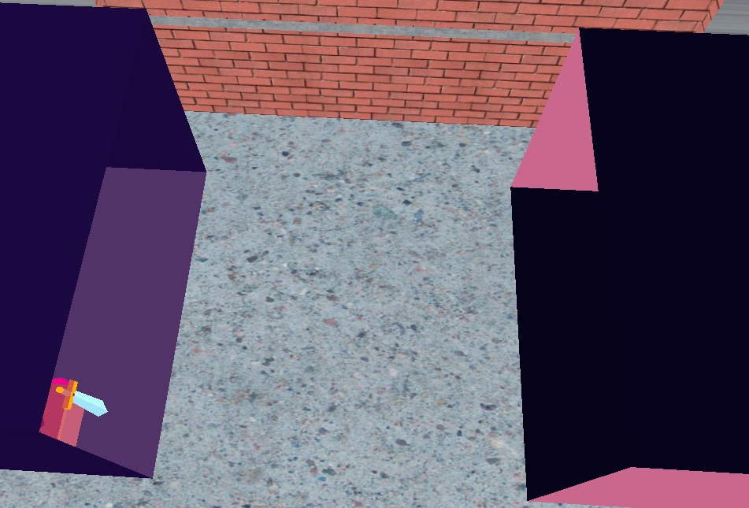</img>

Room 1.

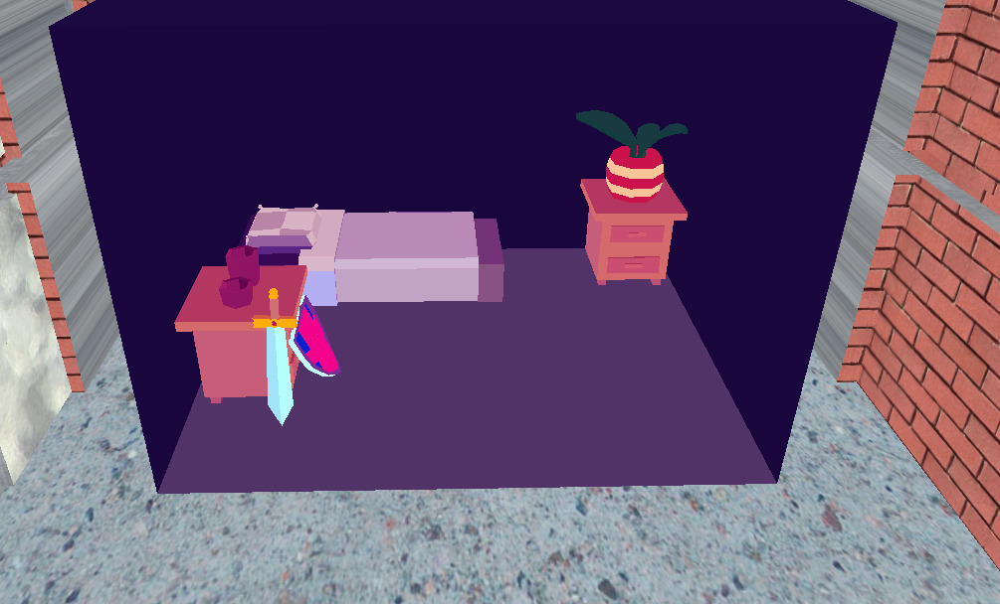</img>

Room 2.

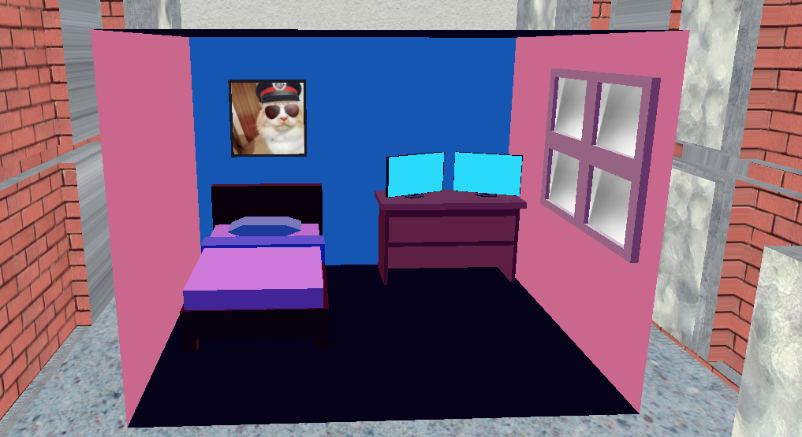</img>

### **Functions**
* ***Teclado***:
    * "Esc" : to exit the window / end the program. ❌

     Simulation of forward ⬆️, back ⬇️, left ⬅️, right ➡️ keys for movement as it happens in video games
     * "W" : move the camera forward ⬆️.
     * "S" : move the camera backwards ⬇️.
     * "A" : move the camera to the left ⬅️.
     * "D" : move the camera to the right ➡️.

 
    ***Animations***:
 
    * "SPACE" : turn vehicle animation ON or OFF 🚗.
    

      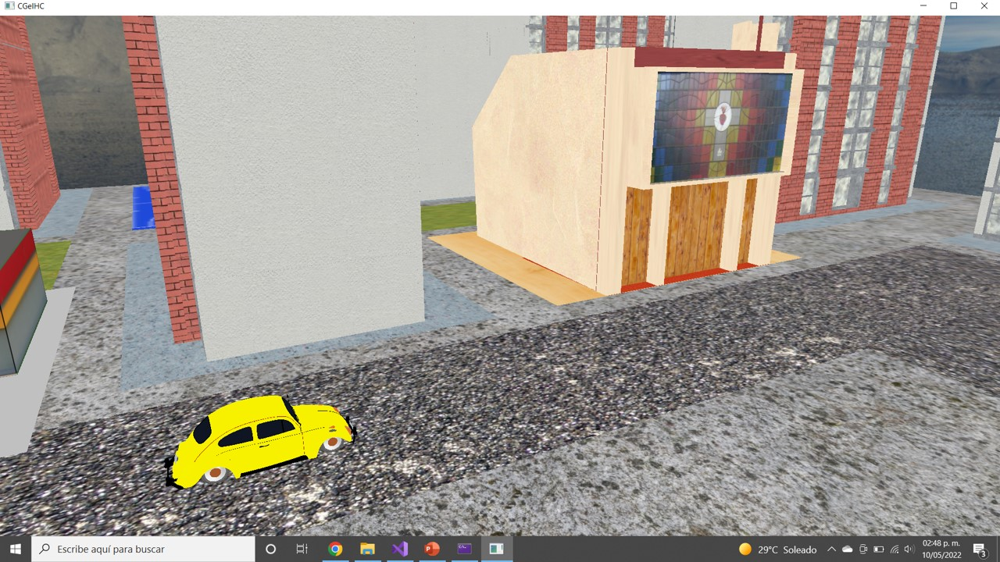</img>
    

     
    * "1"     : activate the animation of the person walking 🚶‍♂️. 
     
    

      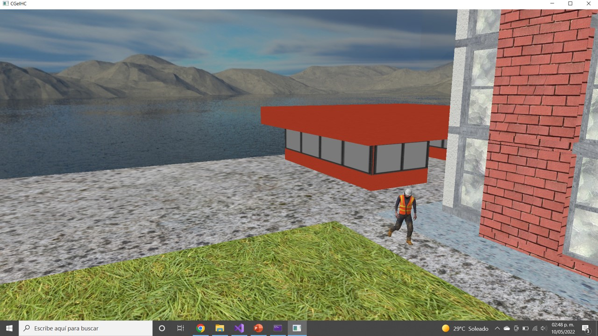</img>
    

     
    * Bike animation does not need user input 🚴‍♂️.
     
    

      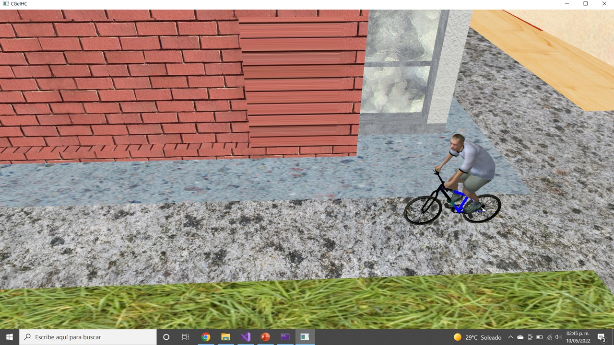</img>
    

     
    * Walking person animation does not need user input 🚶‍♀️🐕.
     
    

      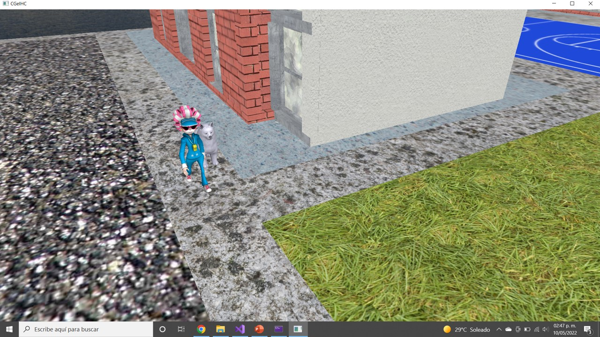</img>
    

     
    * The athlete animation does not require user input ⛹️‍♂️.
     
    

      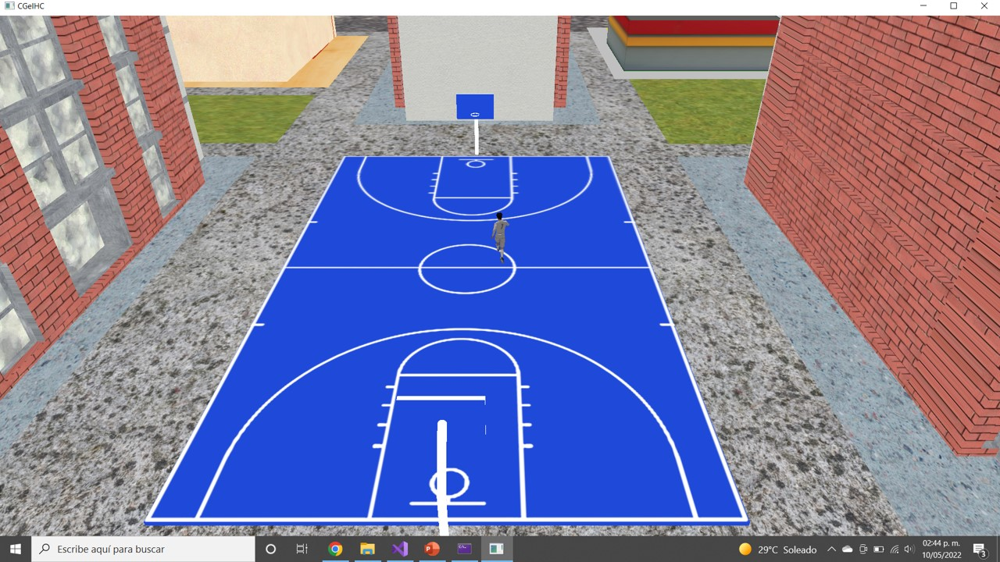</img>
    

    
* **Mouse movements**:
    * Mouse swipe 🔁 left or right, up or down rotates the camera 📷 in that swipe direction, the field of view 🔍 moves like a computer cursor.
     * Mouse scroll performs zoom + 🔍 moving it forward and zoom - 🔍 backward. 
